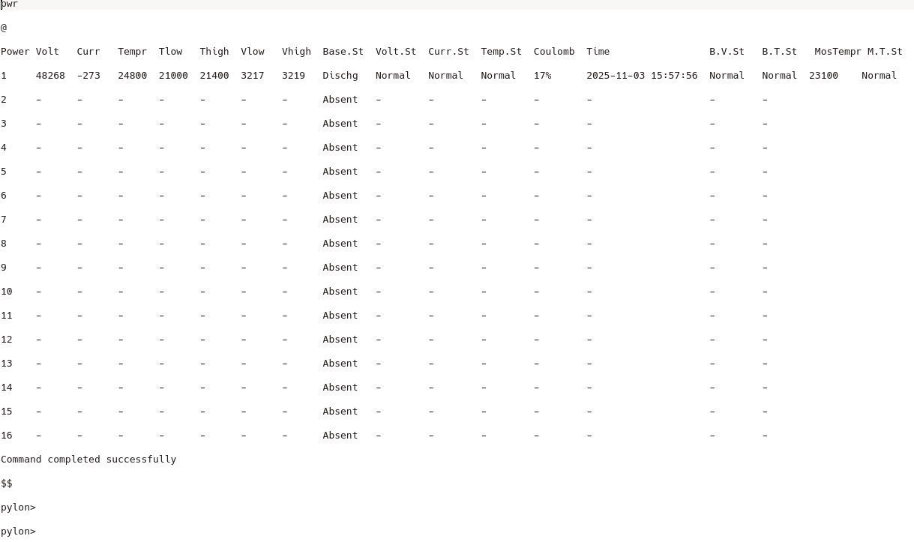
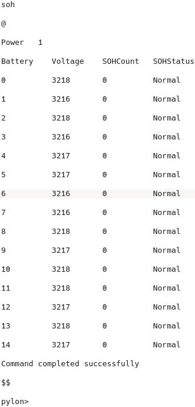

This repo contains the output of two RS485 commands from the US2000C battery. 

These files are saved as commands. 

One is pwr, whose output is 2493 bytes. The pwr file is output in hex and the pwr.txt file is output in ASCII. 

The soh command, whose hex output is in the soh file and the soh.txt file is output in ASCII. 

The shut command turns off the battery.

help command also print command's.

The example program is written in C language and compiled in STM32CUBEIDE. 

The HEX2ASCII.py program is written to convert the hex output taken from the memory window of the stm32cubeide program.
